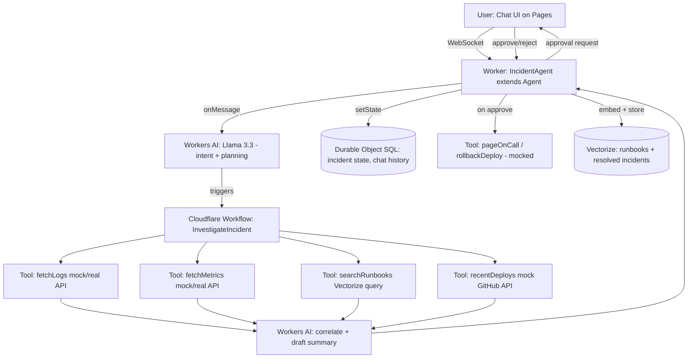

# Project Roadmap: "OpsPilot" — An AI Incident Response Copilot on Cloudflare

> Hand this file to your code-generation model (Kimi/Moonshot, etc.) as the spec. It contains the project choice, architecture, data model, file structure, build phases, and submission checklist needed to go from zero to a working repo.

---

## 0. Why this project (and not a generic chatbot)

The assignment wants a working demonstration of: **LLM + Workflow/coordination + User input (chat/voice) + Memory/state**, built on Cloudflare's agent stack. Most candidates submit a generic "chat with your docs" bot. Given a **backend SDE background**, the strongest project is one that leans into that experience rather than hiding it — reviewers at AI-engineering teams (Applied AI Engineer, ML Engineer roles) specifically look for candidates who can apply LLMs to **real operational/systems problems**, not just wrap an API.

**OpsPilot** is an agent that sits in an on-call/incident-response workflow:

- A user (or a webhook simulating PagerDuty/Datadog) reports "API latency spiked on checkout-service."
- The agent **investigates autonomously**: pulls mock logs/metrics, searches a vectorized runbook library, checks recent deploys, and correlates findings.
- It **drafts an incident summary** and a **recommended remediation**, and — critically — **asks for human approval before taking any state-changing action** (e.g., "page on-call", "roll back deploy").
- It **remembers** past incidents for a service and gets faster/better at triage over time (state + memory).
- It supports **chat** (primary) and optionally **voice** as a stretch goal.

This hits every required component naturally, tells a coherent story in an interview ("I built an agent that mirrors what I actually do as a backend engineer, but automated the triage step"), and is visually demo-able in under 3 minutes.

If you'd rather build something else (e.g., a "meeting-notes-to-Jira" agent, a "customer-support triage" agent), the architecture below is a template — swap the domain, keep the skeleton.

---

## 1. Requirement → Cloudflare Component Map

| Assignment requirement | What we use | Why |
|---|---|---|
| LLM | **Workers AI — Llama 3.3 70B** (`@cf/meta/llama-3.3-70b-instruct-fp8-fast`), with an escape hatch to call an external model (Anthropic/OpenAI) via **AI Gateway** for the harder reasoning steps | Free/cheap default satisfies the "recommend" note; AI Gateway swap shows you understand model routing/observability |
| Workflow / coordination | **Durable Objects** for the agent's per-incident session + **Cloudflare Workflows** for the multi-step investigation pipeline (fetch logs → fetch metrics → search runbooks → correlate → draft summary) | Durable Objects = stateful "brain"; Workflows = durable, retryable, observable multi-step execution — using both shows you understand the difference |
| User input via chat or voice | **Pages** (React chat UI) talking to the Worker over **WebSockets** (via `agents` SDK). Voice = stretch goal using **Cloudflare Calls** or a browser Web Speech API front end | Chat is the core deliverable; voice is bonus points, don't block on it |
| Memory or state | **Durable Object SQL storage** (built into the `Agent` class) for per-incident conversation + incident history; **Vectorize** for the runbook knowledge base (semantic search over past incidents & runbook docs) | Two kinds of memory: structured state (SQL) and semantic memory (vectors) — mention both in the write-up |

Package to install: `npm i agents` (the Cloudflare Agents SDK) — this gives you the `Agent` class with `@callable()` methods, built-in state, scheduling, and WebSocket handling shown in Cloudflare's own docs.

---

## 2. High-Level Architecture



**Flow in words:**
1. User sends a message in chat ("checkout-service is slow").
2. `IncidentAgent` (a Durable Object via the `Agent` class) receives it over WebSocket, saves it to state, and calls the LLM to classify intent (new incident / follow-up / question).
3. For a new incident, the agent kicks off a **Workflow** that runs 3–4 tool calls in parallel (logs, metrics, runbook search, recent deploys) — this is the "coordination" piece and is the most impressive part to demo because Workflows show step-by-step status and survive Worker restarts.
4. Results come back, get passed to the LLM again to synthesize a root-cause hypothesis + recommended action.
5. Agent streams the summary to the user and asks for explicit approval before any "write" action (human-in-the-loop — a detail interviewers love).
6. On resolution, the incident + resolution is embedded and stored in Vectorize, so future similar incidents retrieve it as precedent ("this looks like INC-042 from 3 weeks ago, which was fixed by...").

---

## 3. Data / State Model

### 3.1 Durable Object state (per-agent instance, one per incident *or* one per user session — pick per-incident for the demo)

```ts
type IncidentState = {
  incidentId: string;
  service: string;
  status: "investigating" | "awaiting_approval" | "resolved" | "closed";
  createdAt: number;
  messages: { role: "user" | "assistant" | "tool"; content: string; ts: number }[];
  findings: {
    logs?: string;
    metrics?: string;
    runbookMatches?: { title: string; score: number }[];
    recentDeploys?: string[];
  };
  proposedAction?: { type: string; description: string; requiresApproval: boolean };
  resolutionSummary?: string;
};
```

### 3.2 Vectorize index: `runbook-knowledge`

- Documents: runbook markdown files (write 8–10 fake but realistic ones: "High latency on checkout-service", "Database connection pool exhaustion", "Elevated 5xx after deploy", etc.)
- Metadata: `{ title, service, tags }`
- Also insert **resolved incident summaries** back into this index after resolution → this is what makes the agent "learn" (real memory, not just a chat log).

---

## 4. Repository Structure

```
opspilot/
├── README.md                     # setup, demo instructions, architecture diagram
├── PROMPT_HISTORY.md              # required submission artifact — see §8
├── package.json
├── wrangler.jsonc
├── src/
│   ├── agents/
│   │   └── IncidentAgent.ts       # extends Agent<Env, IncidentState>
│   ├── workflows/
│   │   └── InvestigateIncident.ts # Cloudflare Workflow definition
│   ├── tools/
│   │   ├── fetchLogs.ts           # mock log generator (seeded, realistic)
│   │   ├── fetchMetrics.ts        # mock metrics generator
│   │   ├── searchRunbooks.ts      # Vectorize query wrapper
│   │   └── recentDeploys.ts       # mock GitHub deploys API
│   ├── prompts/
│   │   ├── classifyIntent.ts
│   │   └── synthesizeFindings.ts
│   ├── data/
│   │   └── runbooks/*.md          # seed runbook docs to embed on setup
│   └── index.ts                   # Worker entry, routes WS + HTTP to Agent
├── frontend/                      # Pages app (Vite + React)
│   ├── src/App.tsx                # chat UI, streams agent responses
│   ├── src/components/Approval.tsx# approve/reject action UI
│   └── src/hooks/useAgentSocket.ts
├── scripts/
│   └── seedVectorize.ts           # one-time script to embed runbooks
└── docs/
    └── architecture.png / .mermaid
```

---

## 5. Build Phases (5–7 day plan)

### Phase 0 — Scaffold (½ day)
- `npx create-cloudflare@latest --template cloudflare/agents-starter`
- Confirm local dev works (`npm run dev`), Workers AI binding responds.
- Set up Wrangler config for: Workers AI binding, a Durable Object binding for `IncidentAgent`, a Vectorize index binding, and (optionally) a Workflow binding.

### Phase 1 — Core Agent + Chat Loop (1 day)
- Implement `IncidentAgent extends Agent<Env, IncidentState>` with `onStart`, `onMessage`, and state init.
- Wire the Pages chat UI to connect over WebSocket using the `agents` client hooks.
- Get a naive round-trip working: user message → Llama 3.3 call → streamed response. No tools yet.

### Phase 2 — Tools (mocked data layer) (1 day)
- Write `fetchLogs`, `fetchMetrics`, `recentDeploys` as deterministic mock functions returning realistic-looking data keyed by `service` name (no need for real infra — a JSON/CSV of canned scenarios is fine and expected for an assessment).
- Write 8–10 runbook markdown files; write `seedVectorize.ts` to chunk + embed them into a Vectorize index using a Workers AI embedding model (e.g. `@cf/baai/bge-base-en-v1.5`).
- Implement `searchRunbooks.ts` as a thin Vectorize query wrapper.

### Phase 3 — Workflow orchestration (1 day) — **this is the centerpiece**
- Define `InvestigateIncident` as a Cloudflare Workflow with steps:
  1. `step.do("fetch-logs", ...)`
  2. `step.do("fetch-metrics", ...)`
  3. `step.do("search-runbooks", ...)`
  4. `step.do("recent-deploys", ...)`
  5. `step.do("synthesize", ...)` — calls the LLM with all findings to produce a structured JSON: `{ hypothesis, confidence, recommendedAction, requiresApproval }`
- Trigger the Workflow from `IncidentAgent` when a new incident is detected; poll/await its result and push updates to the client as each step completes (this "live investigation" UI is a great demo moment).

### Phase 4 — Human-in-the-loop approval (½ day)
- When `synthesize` returns an action with `requiresApproval: true`, the agent sets state to `awaiting_approval` and sends an approval card to the UI.
- Implement `@callable() approveAction()` / `rejectAction()` methods on `IncidentAgent`.
- On approval, call the (mocked) action tool (`pageOnCall`, `rollbackDeploy`) and transition state to `resolved`.

### Phase 5 — Memory loop closing (½ day)
- On resolution, embed `{ incidentId, service, hypothesis, resolutionSummary }` and upsert into Vectorize.
- Next time `searchRunbooks` runs for a similar incident, it should surface this past incident — demo this explicitly (create incident #2 similar to #1, show it citing the precedent).

### Phase 6 — Voice (optional stretch, ½–1 day)
- Simplest path: browser `SpeechRecognition` API on the frontend to transcribe → send as a normal chat message; `SpeechSynthesis` to read the agent's summary aloud. This satisfies "voice" without needing Cloudflare Calls/Realtime infra, and you can mention Realtime as a "production version would use this" note in the README.

### Phase 7 — Polish, deploy, record (1 day)
- Deploy Worker + Pages (`wrangler deploy`, Pages via `wrangler pages deploy`).
- Write README with architecture diagram, setup steps, and 3–4 example scenarios to try.
- Record a 2–3 min demo video/gif showing: new incident → investigation steps streaming → approval → resolution → a second similar incident retrieving the first as precedent.
- Finalize `PROMPT_HISTORY.md`.

---

## 6. Prompting Plan

Keep two distinct prompts (don't cram everything into one):

**`classifyIntent` (small, fast, low temperature)**
- Input: latest message + short state summary
- Output (JSON): `{ intent: "new_incident" | "followup" | "question" | "approval_response", service?: string }`

**`synthesizeFindings` (larger context, the "reasoning" step)**
- Input: all tool outputs (logs, metrics, runbook matches, deploys) + incident description
- Output (JSON, use Workers AI structured output or a strict "respond only in JSON" system prompt): `{ hypothesis, confidence: 0-1, evidence: string[], recommendedAction, requiresApproval: boolean, humanSummary: string }`
- `humanSummary` is the natural-language version streamed to the user; the rest drives control flow.

Log every prompt + response pair during development — you need this for `PROMPT_HISTORY.md` anyway.

---

## 7. Evaluation Checklist (map back to what reviewers will look for)

- [ ] LLM is actually doing reasoning/synthesis, not just being a pass-through chatbot
- [ ] Workflow shows clear multi-step coordination with visible/loggable steps
- [ ] State persists across messages in a session (refresh the page mid-incident, state survives)
- [ ] Memory demonstrably changes behavior (precedent retrieval demo)
- [ ] Human-in-the-loop gate before any "destructive" action — shows safety awareness
- [ ] Clean repo structure, README a stranger could follow to run it in <10 min
- [ ] Chat UI is usable, not just curl commands
- [ ] (Stretch) Voice input/output works end to end

---

## 8. Submission Artifacts

1. **GitHub repo** (public), structured as above.
2. **`PROMPT_HISTORY.md`** — since AI-assisted coding is expected but prompt history must be submitted: keep a running log as you go (don't reconstruct it at the end). Format:
   ```
   ## [timestamp/phase] Prompt to <tool>
   <prompt>
   ---
   ## Outcome
   <what you kept / changed / rejected>
   ```
3. **README.md** with: architecture diagram, setup, and demo script.
4. **Demo video/gif** (optional but strongly recommended — link it in the README).

---

## 9. Interview Talking Points (once built)

- How Durable Objects vs. Workflows split responsibilities (state/identity vs. durable multi-step execution) — this is a nuanced point most candidates miss.
- Why you added a human-approval gate — ties directly to production AI-agent safety concerns that Applied AI Engineer interviews probe for.
- How the Vectorize memory loop is a minimal but real example of an agent "learning" from experience without fine-tuning.
- What you'd change for production: real log/metrics integration (Datadog/Prometheus APIs), Cloudflare Realtime for true voice, proper auth on the approval endpoint, eval harness for the synthesis prompt.

---

## 9.5 Maximizing Your Odds (no roadmap guarantees an outcome — this is what actually moves the needle)

Being upfront: nothing makes this "100%." Assessments are one input among several (resume screen, other candidates, headcount, timing). What you control is making the submission hard to pass on. In rough order of impact:

1. **It has to actually run, live, with one click.** A reviewer will not debug your `wrangler.jsonc`. Deploy both the Worker and Pages app, put the live URL at the top of the README, and test it in an incognito window before submitting.
2. **The demo video is doing more work than your code.** Most reviewers skim code but watch the video. 2–3 minutes, script it: show a fresh incident, the Workflow steps streaming live, the approval gate, then a *second* similar incident where the agent visibly cites the first as precedent. That precedent-retrieval moment is the single best "this isn't just a chatbot wrapper" proof point — don't cut it for time.
3. **Prove the AI-assisted-coding line isn't a red flag.** They explicitly ask for prompt history because they're worried candidates ship something they don't understand. Counter that directly: a short "Design Decisions" section in the README where you explain *in your own words* why Durable Objects vs. Workflows split the way they do, and one place in the code with a comment explaining a non-obvious choice. This reads as "used AI as a tool, understands the result" rather than "pasted output."
4. **Handle failure paths, not just the happy path.** One deliberately-broken scenario (e.g., ask about a service with no runbook match, or reject the proposed action) that the agent handles gracefully is worth more than a second feature. Reviewers assessing AI-engineering candidates specifically probe for whether you thought about failure modes.
5. **Commit history tells a story.** Incremental commits with real messages (not one "final version" squash) signal you built it yourself over the week, which matters more than usual given the "AI-assisted" caveat.
6. **Tie it back to their JD in the submission itself**, not just in your head for the interview — one line in the README like "the approval-gate pattern here mirrors production safety requirements for [role]-type systems" costs nothing and shows you read the job description, not just the assignment doc.
7. **Cut scope before cutting quality.** If Phase 6 (voice) or Phase 10 (stretch goals) threatens the deadline, drop them. A tight 4-component demo beats a 6-component demo with a broken edge case.

None of this changes the odds to certain — but it's the difference between "one of many competent submissions" and "the one they remember."

## 10. Stretch Goals (only if time remains)

- Swap the synthesis LLM call to route through **AI Gateway** to an external frontier model for a quality comparison, and log the cost/latency difference — great "I understand model routing tradeoffs" talking point.
- Add a second agent type (`PostmortemAgent`) that runs after resolution to auto-draft a postmortem doc from the incident state — shows multi-agent composition.
- Slack channel integration instead of/alongside the web chat, using Cloudflare's Slack agent example as a base.